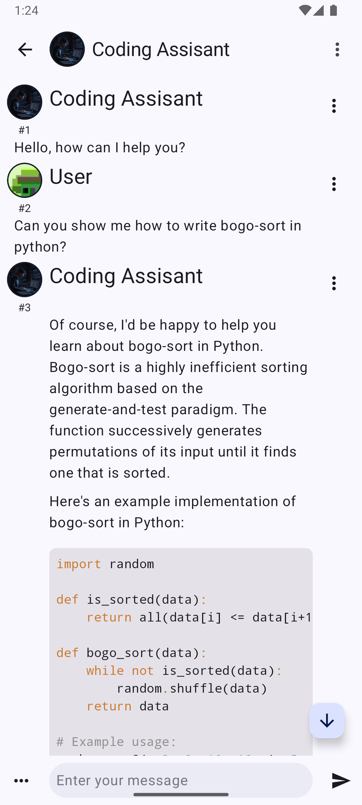

## Intelligent Chat

Universal frontend for managing and chatting with different AI bots.

### Features

- **Character cards**: A character card is a collection of prompts that set the behavior of the LLM.
- **User personas**: Let the AI know a bit about you for greater immersion.
- **Branching**: Control conversation flow with additional swipes for bot replies.
- **Advanced text generation settings**: With support for presets.
- **AI Horde as a backend**: More backends coming later.

### Requirements

Intelligent chat supports Android version down to 7 and can be built with the latest Android Studio
2024.2.2.

### Future features

- [ ] Backups
- [ ] Export of character cards
- [ ] Additional LLM backends including self-hosted
- [ ] TTS 